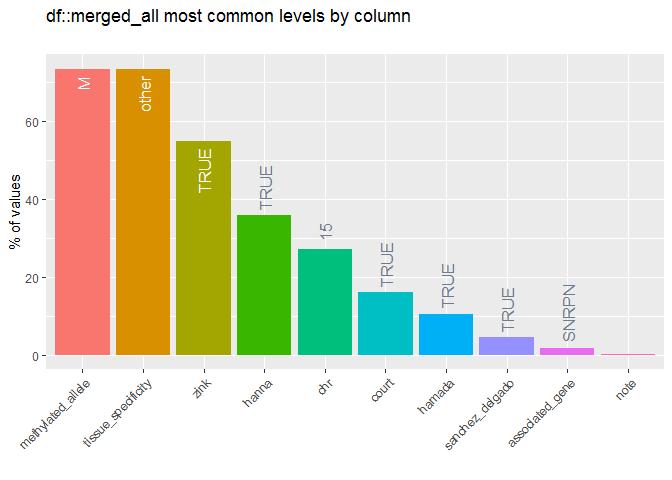
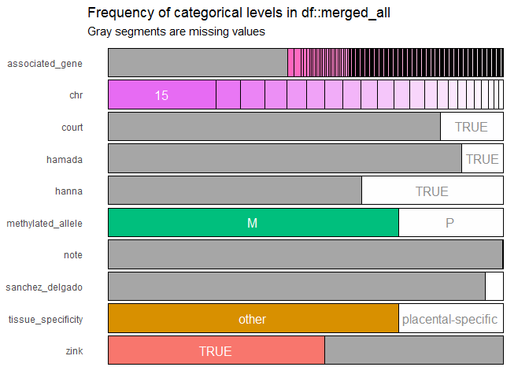

Imprinting is a biological feature where a only one allele is expressed for a gene, which is dependent on its parental origin. This allele-specific expression is regulated by allele-specific DNA methylation. 

Most imprinted genes are ubiquitous, the allele-specificity of expression and DNA methylation is observed in all tissues. However, the placenta also expresses many genes in an allele-specific parental-origin dependent manner. This indicates that imprinting in the placenta serves important roles to it's function, which is not surprising, given that with respect to evolution, imprinting and placentation evolved at the same time.

Many studies have characterized imprinting using expression technology (e.g. RNAseq) and DNA methylation. These studies have accumulated evidence for the existence of many imprints. However, there is lacking a universal reference for human imprinted genes and regions.

Here, I try to compile the evidence for all detected human imprinted regions. My goal is to create a hg19 reference that contains the coordinates for imprinted regions that are 1) expressed in one or more somatic tissues, and 2) specific to the placenta.  

For each publication, I had to do some extra work to obtain the necessary information on the imprinted regions. I describe this extra processing in each section. I had to do things like: figure out which regions were confirmed to be allelically-methylated, figure out which are placental-specific or not.


# Primary Publications

There are many studies that have looked at specific imprinted regions and genes. Here, I briefly describe the most comprehensive studies that have been done to date. Most of these have used some sort of next-generation sequencing technology in combination with high density microarrays to measure DNA methylation and sometimes transcription.

## Hanna et al 2016

**Genome Build:** hg19

**Tissues used:** Placenta, Germ cells

**Technology:** 450k Array

**Approach to determine parental origin:** DMR analysis of triploid (diandric vs digynic) conceptions overlapping with DMRs between oocyte and sperm

**Findings:** Imprinted regions identified for known genes. Novel imprinted regions too. Polymorphic placental-specific imprinting. Some Court et al 2014 DMRs were not reproduced, and did not show germline differences in methylation.

**Number of DMRs:**  43 somatic imprinted DMRs in the placenta that overlapped to Court et al. 2014. 10 of which may be secondary DMRs (no germline differences). 101 novel maternal germline imprinted DMRs, 72 are placenta specific.

At this point > 140 maternal imprinted DMRs in placenta.

limitation is small sample numbers, discovery in 450k CpGs, so there are likely many more DMRs.

> Germline novel DMRs were those that were CGIs (defined by UCSC Genome Browser [https://genome.ucsc.edu/]) that (1) were >50% differentially methylated between sperm and oocytes, (2) were intermediately methylated (15%–60%, based on the 90th percentile observed at known imprinted DMRs) in the blastocyst (average of ICM and TE), (3) showed a >5% difference in methylation between diandric and digynic triploids, and (4) showed matching parental origin of DNA methylation between triploid villi and gametes. Placental-specific DMRs were defined as those with >25% and <75% DNA methylation in placenta and <25% in somatic tissues.


```r
hanna_all <- read_excel(here::here('processed', 'Hanna_processed.xlsx'), skip = 1, sheet = 1) %>%
  janitor::clean_names()
hanna_all
```

```
## # A tibble: 144 x 9
##      dmr chr_start_end closest_tss region hgnc_id cgi_density number_probes
##    <dbl> <chr>         <chr>       <chr>  <chr>   <chr>               <dbl>
##  1     1 chr1:4002497~ PPIEL       Promo~ 33195   HC                      9
##  2     2 chr1:6851183~ DIRAS3 (DM~ Promo~ 687     HC                     10
##  3     3 chr1:6851578~ DIRAS3 (DM~ Promo~ 687     HC                     13
##  4     4 chr4:8961792~ NAP1L5      Promo~ 19968   HC                      8
##  5     5 chr6:3848898~ FAM50B      Promo~ 18789   HC                     28
##  6     6 chr6:1443284~ PLAGL1      Promo~ 9046    HC                     18
##  7     7 chr7:9428550~ PEG10/SGCE  Promo~ 14005/~ HC                     55
##  8     8 chr7:1301303~ MEST/MESTI~ Promo~ 7028/1~ HC                     56
##  9     9 chr7:1548615~ HTR5A       Promo~ 5300    HC                     14
## 10    10 chr8:3760551~ ERLIN2      Promo~ 1356    IC                      6
## # ... with 134 more rows, and 2 more variables: methylated_allele <chr>,
## #   court_et_al_2014_dmr <chr>
```

```r
hanna_pl <- read_excel(here::here('processed', 'Hanna_processed.xlsx'), skip = 1, sheet = 2) %>%
  janitor::clean_names()
hanna_pl
```

```
## # A tibble: 88 x 13
##    gene_name ucsc_coordinate~ chromosome  start    end dmr_id ensembl_gene
##    <chr>     <chr>            <chr>       <dbl>  <dbl> <chr>  <chr>       
##  1 THAP3     chr1:6685210-66~ chr1       6.69e6 6.69e6 THAP3  THAP3       
##  2 AKR7A3    chr1:19609057-1~ chr1       1.96e7 1.96e7 AKR7A3 AKR7A3      
##  3 C1orf216  chr1:36179477-3~ chr1       3.62e7 3.62e7 C1orf~ C1orf216    
##  4 ACOT11    chr1:55013807-5~ chr1       5.50e7 5.51e7 ACOT11 ACOT11      
##  5 PCSK9     chr1:55505149-5~ chr1       5.55e7 5.55e7 PCSK9  PCSK9       
##  6 IL12RB2   chr1:67773047-6~ chr1       6.78e7 6.79e7 IL12R~ IL12RB2     
##  7 TNR       chr1:175291935-~ chr1       1.75e8 1.76e8 TNR    TNR         
##  8 CACNA1E   chr1:181452686-~ chr1       1.81e8 1.82e8 CACNA~ CACNA1E     
##  9 G0S2      chr1:209848670-~ chr1       2.10e8 2.10e8 G0S2   G0S2        
## 10 LINC00467 chr1:211556097-~ chr1       2.12e8 2.12e8 LINC0~ LINC00467   
## # ... with 78 more rows, and 6 more variables: ensembl_chr <dbl>,
## #   ensembl_start <dbl>, ensembl_end <dbl>, te <chr>,
## #   x2nd_trimester_placenta <chr>, x3rd_trimester_placenta <chr>
```

```r
hanna_all %>%
  mutate(placental_specific = closest_tss %in% hanna_pl$dmr_id,
         known_dmr = court_et_al_2014_dmr != 'NA') %>%
  count(known_dmr, placental_specific)
```

```
## # A tibble: 4 x 3
##   known_dmr placental_specific     n
##   <lgl>     <lgl>              <int>
## 1 FALSE     FALSE                 29
## 2 FALSE     TRUE                  72
## 3 TRUE      FALSE                 27
## 4 TRUE      TRUE                  16
```

```r
hanna_final <- hanna_all %>%
  mutate(placental_specific = closest_tss %in% hanna_pl$dmr_id,
         known_dmr = court_et_al_2014_dmr != 'NA') 

hanna_final[hanna_final == 'NA'] <- NA
```

Note, of 101 novel imprinted DMRs, 72 are placental specific. These are not indicated in s2, but were used for the DAVID analysis  in s6. Also, coordinates from s6 do not correspond exactly to s2. In most cases, there are a couple 100 bp differences maximum. I'm not sure exactly but I suspect that s6 is the coordinates of the main isoform/transcript instead of the DMR. I use all coordinates from s2. 


**definition of placental-specific:** 

> Seventy-two novel DMRs showed a placental-specific pattern of imprinting, defined as <25% or >75% methylation in somatic tissues and intermediately (25%–75%) methylated in placenta.

Where somatic tissues are fetal brain, spinal cord, kidney, muscle, and adult blood.

## Court et al 2014

**Genome Build:** hg19

**Tissues:** Placenta, Normal human tissues

**Technology:** WGBSEQ, 450k

**Approach to determine parental origin:** UPDs and hydatidiform moles.

**Findings:** Imprinted regions for all known imprinted genes. 21 novel loci.

Limitation discovery in 450k CpGs (intersected with wgBSeq).

It appears that all relevant data on the confirmed regions is in table 1, and not in the supplementals, which are terribly terribly annotated.


```r
court_ubi <- read_excel(here::here('processed','Court_processed.xlsx'), sheet = 1)
court_pl <- read_excel(here::here('processed','Court_processed.xlsx'), sheet = 2)

court <- court_ubi %>% mutate(type = 'other') %>%
  bind_rows(court_pl %>% mutate(type = 'placental-specific')) %>%
  janitor::clean_names() %>%
  select(chr, start, finish, type, known_dmr, known_imprinting_loci, everything()) %>%
  dplyr::rename(end = finish, number_450k_probes = number_infinium_probes, 
                methylated_allele = methylation_origin)
```

## Sanchez-Delgado et al 2016

**Genome build:** hg19

**Tissues:** germ cells, blastocysts, placenta, various somatic tissues

**Technology:** Methylseq

**Approach:** Identified intermediately methylated PL regions, that are also DMRs in germ cells. Validated with allele-specific assays in 11% of 551 identified regions.

**Findings:** Sometimes imprinted DMRs  do not result in imprinted expression, confirm derived imprinted methylation is maternal/pat with usage of germ cells methylation data.

**Number of DMRs:** Verified Hanna and Court 150 maternally methylated placental-specific DMRs (previously idetnfieid). 551 additional novel DMRs candidates. Only 11% were verified to be monoallelically methylated (all maternal).

Table S2 has a list of regions. They list all candidate 551 maternal gDMRs. 11% of these were confirmed to be mono-allelic methylated. These are not indicated in table S2, but are indicated in table S3. I need table S2 for coordinates of the DMRs.

Table S3 needs to get processed further. I notice that the sample numbers are really small. It's not convincing that these DMRs are imprinted.

We filter to DMRs with "enough" evidence to support their status:

- number of informative cases is greater or equal to  3

After that, we can define impritning as,

- maternall methylated when # of maternal = n_all
- polymorphic when n maternally methylated < n_all

**Note** that they do not provide coordinates for the verified DMRs in table S3. Therefore, I have to merge S2 and S3 based on the only column in common, "Gene". And note that the "Gene" column in table S3 contains non-specific information such as "Chr18" and "Chr1"???. As expected, many of these cannot be merged into table S2 and will just be dropped from the analysis.. 


```r
sandel_candidates <- read_excel(here::here('processed', 'Sanchez_Delgado_processed.xlsx'), sheet = 1)
sandel_confirmed <- read_excel(here::here('processed', 'Sanchez_Delgado_processed.xlsx'), sheet = 2)

sandel_confirmed <- sandel_confirmed %>% 
  # extract evidence for imprinting
  dplyr::rename(description = names(.)[2]) %>%
  mutate(n_mat_methylated = str_extract(description, '[0-9](?= mat)') %>% as.numeric(),
         n_pat_methylated =  str_extract(description, '[0-9](?= pat)') %>% as.numeric(),
         n_bi_methylated =  str_extract(description, '[0-9](?= biall)') %>% as.numeric()) %>%
  rowwise() %>%
  mutate(n_all = sum(n_mat_methylated, n_pat_methylated, n_bi_methylated, na.rm = T)) %>%
  ungroup() %>%
  
  # filter to where there are enough cases to make an inference about status
  filter(n_all > 1) %>%
  
  mutate(status = case_when(
    n_mat_methylated == n_all ~ 'Maternal',
    n_bi_methylated > 0  & n_mat_methylated > 0~ 'Polymorphic',
  ))

sandel_confirmed 
```

```
## # A tibble: 29 x 7
##    Gene  description n_mat_methylated n_pat_methylated n_bi_methylated n_all
##    <chr> <chr>                  <dbl>            <dbl>           <dbl> <dbl>
##  1 FRMD3 2 maternal~                2               NA               3     5
##  2 KCNQ1 8 maternal~                8               NA              NA     8
##  3 TMEM~ 2 maternal~                2               NA              NA     2
##  4 TET3  5 maternal~                5               NA               3     8
##  5 SPHK~ 4 maternal~                4               NA               5     9
##  6 ZNF3~ 2 maternal~                2               NA              NA     2
##  7 C3OR~ 2 maternal~                2               NA               1     3
##  8 FGF12 2 maternal~                2               NA               3     5
##  9 PDE6B 3 maternal~                3               NA              NA     3
## 10 STX1~ 3 maternal~                3               NA              NA     3
## # ... with 19 more rows, and 1 more variable: status <chr>
```

```r
sandel_confirmed <- sandel_confirmed %>% 
  mutate(methylated_allele = if_else(n_bi_methylated == n_all, 'bi', 'M', missing = 'M'),
         percent_biallelic = n_bi_methylated*100 / n_all) %>%
  select(Gene, methylated_allele, percent_biallelic, n_all) %>%
  dplyr::rename(n_used_to_verify_allele_specific_methylation = n_all) %>%
  
  # remove 100% biallelic
  filter(methylated_allele != 'bi')
sandel_confirmed
```

```
## # A tibble: 22 x 4
##    Gene     methylated_allele percent_biallel~ n_used_to_verify_allele_specific~
##    <chr>    <chr>                        <dbl>                             <dbl>
##  1 FRMD3    M                             60                                   5
##  2 KCNQ1    M                             NA                                   8
##  3 TMEM247  M                             NA                                   2
##  4 TET3     M                             37.5                                 8
##  5 SPHKAP   M                             55.6                                 9
##  6 ZNF385D  M                             NA                                   2
##  7 C3ORF62  M                             33.3                                 3
##  8 FGF12    M                             60                                   5
##  9 PDE6B    M                             NA                                   3
## 10 STX18-A~ M                             NA                                   3
## # ... with 12 more rows
```

column `n_used_to_verify_allele_specific_methylation` is the # of samples used to verify allele specific methylation.
column `percent_biallelic` is the percentage of samples that show biallelic methylation. If > 0, indicates polymorphic.


```r
# Which in s3 are not found in table s2
sandel_confirmed$Gene %in% sandel_candidates$Gene
```

```
##  [1]  TRUE  TRUE  TRUE FALSE  TRUE  TRUE FALSE  TRUE FALSE  TRUE FALSE  TRUE
## [13]  TRUE FALSE FALSE  TRUE FALSE FALSE  TRUE FALSE FALSE  TRUE
```

```r
sandel_confirmed %>%
  filter(!Gene %in% sandel_candidates$Gene)
```

```
## # A tibble: 10 x 4
##    Gene     methylated_allele percent_biallel~ n_used_to_verify_allele_specific~
##    <chr>    <chr>                        <dbl>                             <dbl>
##  1 TET3     M                             37.5                                 8
##  2 C3ORF62  M                             33.3                                 3
##  3 PDE6B    M                             NA                                   3
##  4 GPR78    M                             50                                   2
##  5 DENND3   M                             44.4                                 9
##  6 CACNA1C  M                             NA                                   2
##  7 PAPLN-A~ M                             NA                                   2
##  8 Chr 18   M                             NA                                   3
##  9 ACTL10   M                             NA                                   2
## 10 TPTEP1   M                             NA                                   5
```

```r
# join based on "Gene"
sandel <- sandel_candidates %>%
  fuzzyjoin::regex_right_join(sandel_confirmed, by = 'Gene') %>%
  select(contains('.x'), contains('.y'), everything())  %>%
  
  # remove s3 entries with no match in s2
  filter(!is.na(Gene.x)) %>%
  dplyr::rename(gene = Gene.y) %>%
  select(-Gene.x) %>%
  
  janitor::clean_names() %>%
  dplyr::rename(chr = chromosome, cpg_island = cp_g_island, cpg_n =cp_gn)

sandel
```

```
## # A tibble: 16 x 11
##    gene  chr    start    end width cpg_island cpg_n gene_pos methylated_alle~
##    <chr> <chr>  <dbl>  <dbl> <dbl> <chr>      <dbl> <chr>    <chr>           
##  1 FRMD3 chr9  8.61e7 8.61e7  1278 no            31 Gene_bo~ M               
##  2 FRMD3 chr9  8.62e7 8.62e7  2911 yes          169 Promoter M               
##  3 KCNQ1 chr11 2.49e6 2.49e6  1722 no            53 Gene_bo~ M               
##  4 TMEM~ chr2  4.67e7 4.67e7  1491 no            52 Promoter M               
##  5 TET3  chr2  7.43e7 7.43e7  2712 yes           77 intrege~ M               
##  6 SPHK~ chr2  2.29e8 2.29e8  3526 yes          126 Promoter M               
##  7 ZNF3~ chr3  2.18e7 2.18e7  1665 no            25 Promoter M               
##  8 FGF12 chr3  1.92e8 1.92e8  2824 yes          149 Promoter M               
##  9 STX1~ chr4  4.58e6 4.58e6  1692 yes           86 Gene_bo~ M               
## 10 SFRP2 chr4  1.55e8 1.55e8  6021 yes          312 Promoter M               
## 11 R3HC~ chr8  2.31e7 2.31e7  1322 yes           59 Promoter M               
## 12 DENN~ chr8  1.42e8 1.42e8  1288 yes           97 intrege~ M               
## 13 CACN~ chr12 2.80e6 2.80e6   358 yes           33 Promoter M               
## 14 FGF14 chr13 1.03e8 1.03e8  1856 yes          161 Promoter M               
## 15 CACN~ chr19 1.36e7 1.36e7  3305 yes          140 Promoter M               
## 16 CACN~ chr22 4.01e7 4.01e7  3728 yes          198 Gene_bo~ M               
## # ... with 2 more variables: percent_biallelic <dbl>,
## #   n_used_to_verify_allele_specific_methylation <dbl>
```

## Hamada 2016 

**Genome Build:** hg19

**Tissues:** Placenta, Cytotrophoblasts, germ cells, blood, stromal from CV

**Technology:** WGBSEQ, RNAseq

**Approach:** Determine allele-specific meth/rna via sequencing in Cyto. Supported by germ cell DMR analysis.

**Findings:** 440 confirmed maternally methylated primary imprinted DMRs (mDMRs). Out of 101 mDMRs that Courtney identified, 31 were tested in this study, and 25 of those were confirmed. An advantage of this study over previous is they used entirely wgBSEQ -> they suggest there are around 1800 imprinted DMRs based on their results.

Limitation is discovery was an N of 1. (Candidates were followed up with more samples in a targeted approach). Suggests a proportion of DMRs are not placental-specific.


```r
hamada_s3 <- read_excel(here::here('raw files', 'Hamada 2016 s3.xlsx'))
hamada_s4 <- read_excel(here::here('raw files', 'Hamada 2016 s4.xlsx'))

# remove data columns
hamada_s3 <- hamada_s3 %>%
  select(Classification:`Ranking according to mean [M-P]`) %>%
  mutate(Trimester = 'First')
hamada_s4 <- hamada_s4 %>%
  select(Classification:`Ranking according to mean [M-P]`) %>%
  mutate(Trimester = 'Second/Term')

hamada <- bind_rows(hamada_s3, hamada_s4) %>%
  janitor::clean_names()
```

Filter to significant DMRs, as defined in source:

> We defined candidate mDMRs or pDMRs showing >30% or <-30% mean [M - P] levels and statistically significant allelic methylation differences (BH-corrected p < 0.05, Student’s t test) as confirmed gDMRs.


```r
hamada %>%
  count(trimester, classification) # 797 and 449 for 1st vs term/2nd
```

```
## # A tibble: 4 x 3
##   trimester   classification     n
##   <chr>       <chr>          <int>
## 1 First       Candidate mDMR   797
## 2 First       Candidate pDMR    97
## 3 Second/Term Candidate mDMR   449
## 4 Second/Term Candidate pDMR    43
```

```r
hamada %>%
  filter(corrected_p_value < 0.05, abs(mean_m_p_percent) >= 30) %>%
  count(trimester, classification)
```

```
## # A tibble: 4 x 3
##   trimester   classification     n
##   <chr>       <chr>          <int>
## 1 First       Candidate mDMR   384
## 2 First       Candidate pDMR    13
## 3 Second/Term Candidate mDMR   151
## 4 Second/Term Candidate pDMR     1
```

```r
hamada <- hamada %>%
  filter(corrected_p_value < 0.05, abs(mean_m_p_percent) >= 30) 

hamada
```

```
## # A tibble: 549 x 12
##    classification chromosome  start    end gene  region mean_m_percent
##    <chr>          <chr>       <dbl>  <dbl> <chr> <chr>           <dbl>
##  1 Candidate mDMR chr1       7.32e6 7.32e6 CAMT~ Gene ~           72.9
##  2 Candidate mDMR chr1       2.18e7 2.18e7 -     -                89.2
##  3 Candidate mDMR chr1       2.49e7 2.49e7 RCAN3 Gene ~           67.7
##  4 Candidate mDMR chr1       4.24e7 4.24e7 HIVE~ Promo~           57.6
##  5 Candidate mDMR chr1       4.78e7 4.78e7 CMPK1 Gene ~           63.1
##  6 Candidate mDMR chr1       8.66e7 8.66e7 COL2~ Gene ~           74.2
##  7 Candidate mDMR chr1       8.66e7 8.66e7 COL2~ Promo~           65.6
##  8 Candidate mDMR chr1       1.55e8 1.55e8 FAM1~ Gene ~           64.5
##  9 Candidate mDMR chr1       1.80e8 1.80e8 -     -                81.2
## 10 Candidate mDMR chr1       1.81e8 1.81e8 -     -                76.3
## # ... with 539 more rows, and 5 more variables: mean_p_percent <dbl>,
## #   mean_m_p_percent <dbl>, corrected_p_value <dbl>,
## #   ranking_according_to_mean_m_p <dbl>, trimester <chr>
```

Note that these are just candidate impritned regions because they show > 30% difference between oocyte and sperm. **The 440 regions that were validated using ASM assays are not indicated in any supplemental tables!** Therefore I cannot use this reference to add novel imprinted regions. However, what I can do is add an indicator if one of these candidate regions overlaps another source's regions, which would be supportive evidence for that DMR.

## Zink et al 2018

**Genome build:** hg38

**Tissues:** adult blood

**Technology:** WGBSEQ, RNAseq, genotyping arrays

**Findings:** 229 imprinted regions. Most localized to Chr15. Some polymorphic. Some with parent-allele-specific snp effect.


```r
zink_s1 <- read_excel(here::here('raw files', 'Zink 2018.xlsx'), sheet = 2, skip = 2) %>%
  dplyr::rename(chr = Chrom, start = peakStart, end = peakEnd)

# convert to hg19

# load chain file
path <- system.file(package="liftOver", "extdata", "hg38ToHg19.over.chain")
ch <- import.chain(path)
ch
```

```
## Chain of length 25
## names(25): chr22 chr21 chr19 chr20 chrY chr18 ... chr6 chr5 chr4 chr3 chr2 chr1
```

```r
# coerce to granges object
zink_s1_hg19 <- zink_s1 %>%
  makeGRangesFromDataFrame(keep.extra.columns = T)
seqlevelsStyle(zink_s1_hg19) <- 'UCSC'

# hg19 to hg38 coordinates
zink_s1_hg19 <- liftOver(zink_s1_hg19, ch) %>% unlist %>% as_tibble
zink_s1_hg19
```

```
## # A tibble: 229 x 36
##    seqnames  start    end width strand  nCpG nCpG_sig methDiff avg_pfrac
##    <fct>     <int>  <int> <int> <fct>  <dbl>    <dbl>    <dbl>     <dbl>
##  1 chr1     7.89e6 7.89e6   571 *         33       33   -0.281    0.521 
##  2 chr1     4.00e7 4.00e7   379 *         24       22   -0.425    0.469 
##  3 chr1     6.85e7 6.85e7  1259 *         57       57   -0.690    0.120 
##  4 chr1     1.77e8 1.77e8   181 *         14       14   -0.120    0.788 
##  5 chr10    1.32e8 1.32e8   716 *         38       29   -0.151    0.517 
##  6 chr11    2.15e6 2.16e6  1531 *         67       51    0.404    0.777 
##  7 chr11    2.17e6 2.17e6  3472 *         82       76    0.516    0.728 
##  8 chr11    2.72e6 2.72e6  1537 *        149      117   -0.751    0.0429
##  9 chr11    7.11e6 7.11e6   541 *         52       49   -0.340    0.485 
## 10 chr11    6.04e7 6.04e7   434 *         31       25   -0.207    0.660 
## # ... with 219 more rows, and 27 more variables: avg_mfrac <dbl>, score <dbl>,
## #   fdr <dbl>, DMRStartCourt <dbl>, DMREndCourt <dbl>, GeneSymbolCourt <chr>,
## #   DMRStartJoshi <dbl>, DMREndJoshi <dbl>, GeneSymbolJoshi <chr>,
## #   closestEnsemblGene <chr>, ASEGenes <chr>, KnownImprintedGenes <chr>,
## #   pval_imp <dbl>, pval_imp_cond <dbl>, beta_snp <dbl>, beta_po <dbl>,
## #   p_snp <dbl>, p_po <dbl>, AF <dbl>, Marker <chr>, Blastocyst <dbl>,
## #   Oocyte <dbl>, Sperm <dbl>, delta <dbl>, pval <dbl>, npns <dbl>,
## #   status <chr>
```

This table looks fine to leave as is

# Terminology

| Term | Definition | 
| :--- | :--- |
| DMR | Sometimes imprinted regions characterized by allele-specific methylation are referred to as differentially methylated regions (DMR), where differential methylation refers to the opposite methylation states of the parental alleles | mDMR | maternally methylated DMR. An Imprinted region where the maternal allele is methylated. Most placental imprints have the maternal allele methylated. |


# Merge all

Here I combine all lists of DMRs

To do this we need to harmonize several columns. These are the columns we can have for the final table:

| description | column name|
| :--- | ---:|
|position (chr, start, end)| chr, start, end|
|ubiquitous vs placental-specific| tissue_specificity|
|associated gene (or closest TSS)| associated_gene|
|methylated allele (mat/pat)| methylated_allele|
|supporting references| supporting_refs|

## Harmonize data

### Court


```r
court$type %>% table
```

```
## .
##              other placental-specific 
##                 50                 17
```

```r
court$methylated_allele %>% table
```

```
## .
##  M  P 
## 59  8
```

```r
court$chr %>% table
```

```
## .
##  1  2  3  4  5  6  7  8  9 10 11 13 14 15 16 17 18 19 20 21 22 
##  3  2  1  1  1  6  5  3  2  2  5  2  3 13  2  1  1  5  7  1  1
```

```r
court_merge <- court %>%
  dplyr::rename(tissue_specificity = type,
         associated_gene = gene_locus) %>%
  mutate(court = TRUE,
         chr = chr %>% factor(levels = c(1:22, 'X'))) %>%
  select(chr, start, end, tissue_specificity, associated_gene, methylated_allele, court)

court_merge
```

```
## # A tibble: 67 x 7
##    chr     start     end tissue_specific~ associated_gene methylated_alle~ court
##    <fct>   <dbl>   <dbl> <chr>            <chr>           <chr>            <lgl>
##  1 1      6.85e7  6.85e7 other            DIRAS3          M                TRUE 
##  2 2      2.07e8  2.07e8 other            ZDBF2           P                TRUE 
##  3 4      8.96e7  8.96e7 other            NAP1L5          M                TRUE 
##  4 6      3.85e6  3.85e6 other            FAM50B          M                TRUE 
##  5 6      1.44e8  1.44e8 other            PLAGL1          M                TRUE 
##  6 6      1.60e8  1.60e8 other            IGF2R           M                TRUE 
##  7 7      5.08e7  5.09e7 other            GRB10           M                TRUE 
##  8 7      9.43e7  9.43e7 other            PEG10           M                TRUE 
##  9 7      1.30e8  1.30e8 other            MEST            M                TRUE 
## 10 8      1.41e8  1.41e8 other            TRAPPC9         M                TRUE 
## # ... with 57 more rows
```

### Hanna


```r
hanna_final$methylated_allele %>% table
```

```
## .
##   M   P 
## 139   5
```

```r
hanna_final$placental_specific %>% table
```

```
## .
## FALSE  TRUE 
##    56    88
```

```r
hanna_final_merge <- hanna_final %>%
  separate(chr_start_end, c('chr', 'start', 'end')) %>%
  mutate(chr = str_extract(chr, '(?<=chr).*') %>% factor(levels = c(1:22, 'X')),
         start = as.numeric(start),
         end = as.numeric(end),
         tissue_specificity = if_else(placental_specific, 'placental-specific', 'other'),
         hanna = TRUE) %>%
  rename(associated_gene = closest_tss) %>%
  select(chr, start, end, tissue_specificity, associated_gene, methylated_allele, hanna)
hanna_final_merge
```

```
## # A tibble: 144 x 7
##    chr     start     end tissue_specific~ associated_gene methylated_alle~ hanna
##    <fct>   <dbl>   <dbl> <chr>            <chr>           <chr>            <lgl>
##  1 1      4.00e7  4.00e7 other            PPIEL           M                TRUE 
##  2 1      6.85e7  6.85e7 other            DIRAS3 (DMR3)   M                TRUE 
##  3 1      6.85e7  6.85e7 other            DIRAS3 (DMR2)   M                TRUE 
##  4 4      8.96e7  8.96e7 other            NAP1L5          M                TRUE 
##  5 6      3.85e6  3.85e6 other            FAM50B          M                TRUE 
##  6 6      1.44e8  1.44e8 other            PLAGL1          M                TRUE 
##  7 7      9.43e7  9.43e7 other            PEG10/SGCE      M                TRUE 
##  8 7      1.30e8  1.30e8 other            MEST/MESTIT1    M                TRUE 
##  9 7      1.55e8  1.55e8 other            HTR5A           M                TRUE 
## 10 8      3.76e7  3.76e7 other            ERLIN2          M                TRUE 
## # ... with 134 more rows
```

### Sanchez-Delgado


```r
sandel$chr %>% table
```

```
## .
## chr11 chr12 chr13 chr19  chr2 chr22  chr3  chr4  chr8  chr9 
##     1     1     1     1     3     1     2     2     2     2
```

```r
sandel$methylated_allele %>% table
```

```
## .
##  M 
## 16
```

```r
sandel_merge <- sandel %>%
  mutate(chr = str_extract(chr, '(?<=chr).*') %>% factor(levels = c(1:22, 'X')),
         methylated_allele = toupper(methylated_allele),
         sanchez_delgado = TRUE,
         tissue_specificity = 'placental-specific') %>%
  rename(associated_gene = gene)%>%
  select(chr, start, end, tissue_specificity, associated_gene, methylated_allele, sanchez_delgado)
sandel_merge
```

```
## # A tibble: 16 x 7
##    chr    start    end tissue_specific~ associated_gene methylated_alle~
##    <fct>  <dbl>  <dbl> <chr>            <chr>           <chr>           
##  1 9     8.61e7 8.61e7 placental-speci~ FRMD3           M               
##  2 9     8.62e7 8.62e7 placental-speci~ FRMD3           M               
##  3 11    2.49e6 2.49e6 placental-speci~ KCNQ1           M               
##  4 2     4.67e7 4.67e7 placental-speci~ TMEM247         M               
##  5 2     7.43e7 7.43e7 placental-speci~ TET3            M               
##  6 2     2.29e8 2.29e8 placental-speci~ SPHKAP          M               
##  7 3     2.18e7 2.18e7 placental-speci~ ZNF385D         M               
##  8 3     1.92e8 1.92e8 placental-speci~ FGF12           M               
##  9 4     4.58e6 4.58e6 placental-speci~ STX18-AS1       M               
## 10 4     1.55e8 1.55e8 placental-speci~ SFRP2           M               
## 11 8     2.31e7 2.31e7 placental-speci~ R3HCC1          M               
## 12 8     1.42e8 1.42e8 placental-speci~ DENND3          M               
## 13 12    2.80e6 2.80e6 placental-speci~ CACNA1C         M               
## 14 13    1.03e8 1.03e8 placental-speci~ FGF14           M               
## 15 19    1.36e7 1.36e7 placental-speci~ CACNA1A         M               
## 16 22    4.01e7 4.01e7 placental-speci~ CACNA1I         M               
## # ... with 1 more variable: sanchez_delgado <lgl>
```

### Hamada


```r
hamada$chromosome %>% table
```

```
## .
##  chr1 chr10 chr11 chr12 chr13 chr14 chr15 chr16 chr17 chr18 chr19  chr2 chr20 
##    24    29    26    31    21    17     9    20    10    18    23    68    21 
## chr21 chr22  chr3  chr4  chr5  chr6  chr7  chr8  chr9  chrX 
##     7     5    23    27    23    22    61    40    16     8
```

```r
hamada_merge <- hamada %>%
  mutate(chr = str_extract(chromosome, '(?<=chr).*') %>% factor(levels = c(1:22, 'X')),
         hamada = TRUE,
         tissue_specificity = 'placental-specific',
         methylated_allele = if_else(mean_m_percent > mean_p_percent, 'M', 'P'),
         gene = if_else(gene == '-', NA_character_, gene)) %>%
  rename(associated_gene = gene) %>%
  select(chr, start, end, tissue_specificity, associated_gene, methylated_allele, hamada)

hamada_merge
```

```
## # A tibble: 549 x 7
##    chr     start    end tissue_specific~ associated_gene methylated_alle~ hamada
##    <fct>   <dbl>  <dbl> <chr>            <chr>           <chr>            <lgl> 
##  1 1      7.32e6 7.32e6 placental-speci~ CAMTA1          M                TRUE  
##  2 1      2.18e7 2.18e7 placental-speci~ <NA>            M                TRUE  
##  3 1      2.49e7 2.49e7 placental-speci~ RCAN3           M                TRUE  
##  4 1      4.24e7 4.24e7 placental-speci~ HIVEP3          M                TRUE  
##  5 1      4.78e7 4.78e7 placental-speci~ CMPK1           M                TRUE  
##  6 1      8.66e7 8.66e7 placental-speci~ COL24A1         M                TRUE  
##  7 1      8.66e7 8.66e7 placental-speci~ COL24A1         M                TRUE  
##  8 1      1.55e8 1.55e8 placental-speci~ FAM189B         M                TRUE  
##  9 1      1.80e8 1.80e8 placental-speci~ <NA>            M                TRUE  
## 10 1      1.81e8 1.81e8 placental-speci~ <NA>            M                TRUE  
## # ... with 539 more rows
```

### Zink


```r
zink_s1$chr %>% table
```

```
## .
##  chr1 chr10 chr11 chr12 chr13 chr14 chr15 chr16 chr17 chr18 chr19  chr2 chr20 
##     4     1     5     5     3    13    98     9     2     3    11    16    12 
## chr21 chr22  chr3  chr4  chr5  chr6  chr7  chr8  chr9 
##     3     2     4     7     6     6     9     9     1
```

```r
zink_merge <- zink_s1 %>%
  mutate(chr = str_extract(chr, '(?<=chr).*') %>% factor(levels = c(1:22, 'X')),
         zink = TRUE,
         tissue_specificity = 'other',
         methylated_allele = if_else(avg_mfrac > avg_pfrac, 'M', 'P')) %>%
  rowwise() %>%
  mutate(associated_gene = paste0(unique(na.omit(c(GeneSymbolCourt, GeneSymbolJoshi))), collapse = '/'),
         associated_gene = if_else(associated_gene == "", NA_character_, associated_gene)) %>%
  ungroup() %>%
  select(chr, start, end, tissue_specificity, associated_gene, methylated_allele, zink)  ;zink_merge
```

```
## # A tibble: 229 x 7
##    chr     start     end tissue_specific~ associated_gene methylated_alle~ zink 
##    <fct>   <dbl>   <dbl> <chr>            <chr>           <chr>            <lgl>
##  1 1      7.83e6  7.83e6 other            <NA>            M                TRUE 
##  2 1      3.96e7  3.96e7 other            PPIEL           M                TRUE 
##  3 1      6.81e7  6.81e7 other            DIRAS3/GNG12-A~ M                TRUE 
##  4 1      1.77e8  1.77e8 other            <NA>            M                TRUE 
##  5 10     1.30e8  1.30e8 other            <NA>            M                TRUE 
##  6 11     2.13e6  2.13e6 other            IGF2            P                TRUE 
##  7 11     2.15e6  2.15e6 other            IGF2            P                TRUE 
##  8 11     2.70e6  2.70e6 other            KvDMR1          M                TRUE 
##  9 11     7.09e6  7.09e6 other            <NA>            M                TRUE 
## 10 11     6.06e7  6.06e7 other            <NA>            M                TRUE 
## # ... with 219 more rows
```

## Joins

Now that all tables have harmonized data, we can begin merging.

Note that a decision needs to be made to choose the start and end coordinates of overlapping DMRs. I opted for the "union", which is the outer most coordinates of overlapping regions.

Throughout all the joins, I did this:

- Manually determine which gene symbol to take. 
- Manually determine if any conflicting evidence for the methylated allele and tissue specificity.


```r
merged_court_hanna <- court_merge %>%
  genome_full_join(hanna_final_merge, by = c('chr', 'start', 'end')) %>%
  
  # harmonize columns 
  rowwise() %>%
  mutate(chr = na.omit(c(chr.x, chr.y)) %>% unique() %>% paste(collapse = ' ') %>%
           factor(levels = c(1:22, 'X')),
         end = max(end.x, end.y, na.rm = TRUE),
         start = min(start.x, start.y, na.rm = TRUE),
         
         # manually check that these new columns have only a single entry
         methylated_allele = na.omit(c(methylated_allele.x, methylated_allele.y)) %>% 
           unique() %>% paste(collapse = ' '),
         tissue_specificity = na.omit(c(tissue_specificity.x, tissue_specificity.y)) %>% 
           unique() %>% paste(collapse = ' '),
         
         # manually determine the associated gene
         associated_gene = case_when(
           associated_gene.x == 'DIRAS3' ~ 'DIRAS3',
           associated_gene.x == 'H19' ~ 'H19',
           associated_gene.x == 'SNURF' ~ 'SNURF/SNRPN',
           associated_gene.x == 'ZNF597/NAA60' ~ 'ZNF597/NAA60',
           associated_gene.x == 'MCTS2P/HM13' ~ 'MCTS2P/HM13',
           associated_gene.x == 'BLCAP/NNAT' ~ 'BLCAP/NNAT',
           associated_gene.x == 'GNAS' ~ 'GNAS',
           associated_gene.x == 'GNAS XL' ~ 'GNAS XL',
           associated_gene.x == 'DIRAS3 Ex2' ~ 'DIRAS3',
           associated_gene.x == 'FAM196A/DOCK1' ~ 'FAM196A/DOCK1',
           TRUE ~ associated_gene.y
         )) %>%
  
  ungroup() %>%
  select(-contains('.x'), -contains('.y')) %>%
  select(chr:associated_gene, everything()) %>%
  arrange(chr, start, end)
  
## merge overlapping regions
# First show the overlapping regions
merged_court_hanna %>% 
  arrange(chr, start) %>%
  group_by(chr) %>%
  
  # identify overlapping ranges
  mutate(previous_end = cummax(lag(end, default = 0)), # get the previous row's end or the cummax
         new_group = (start >= previous_end),
         group = cumsum(new_group))  %>% 
  
  # filter to when there are overlapping regions
  group_by(chr, group) %>% filter(n() > 1) %>% select(chr, end, start, previous_end)
```

```
## Adding missing grouping variables: `group`
```

```
## # A tibble: 2 x 5
## # Groups:   chr, group [1]
##   group chr       end   start previous_end
##   <int> <fct>   <dbl>   <dbl>        <dbl>
## 1     1 11    2024740 2016513            0
## 2     1 11    2024740 2018812      2024740
```

```r
# merge
merged_court_hanna <- merged_court_hanna %>% 
  arrange(chr, start) %>%
  group_by(chr) %>%
  
  # identify overlapping ranges
  mutate(previous_end = cummax(lag(end, default = 0)), # get the previous row's end or the cummax
         new_group = (start >= previous_end),
         group = cumsum(new_group))  %>% 
  
  # merge overlapping regions
  group_by(chr, group) %>%
  summarize(start = min(start),
            end = max(end),
            
            # keep other columns the same
            methylated_allele = paste0(unique(methylated_allele), collapse = ','),
            tissue_specificity = paste0(unique(tissue_specificity), collapse = ','),
            associated_gene = paste0(unique(associated_gene), collapse = ','),
            court = paste0(unique(court), collapse = ','),
            hanna = paste0(unique(hanna), collapse = ',')) %>%
  ungroup() %>%
  mutate(court = if_else(is.na(court), NA, as.logical(court)),
         hanna = if_else(is.na(hanna), NA, as.logical(hanna))) %>% 
  select(-group) 
```

There were 2 regions with overlapping regions that I ended up merging. This was easy this time since all the other columns were the same. It could get complicated if two overlapping regions have different information. We will see in the next joins if that occurs.


```r
merged_court_hanna_sandel <- merged_court_hanna %>%
  genome_full_join(sandel_merge, by = c('chr', 'start', 'end'))  %>%
  
  # harmonize columns 
  rowwise() %>%
  mutate(chr = na.omit(c(chr.x, chr.y)) %>% unique() %>% paste(collapse = ' ') %>%
           factor(levels = c(1:22, 'X')),
         end = max(end.x, end.y, na.rm = TRUE),
         start = min(start.x, start.y, na.rm = TRUE),
         
         # manually check that these new columns have only a single entry
         methylated_allele = na.omit(c(methylated_allele.x, methylated_allele.y)) %>% 
           unique() %>% paste(collapse = ' '),
         tissue_specificity = na.omit(c(tissue_specificity.x, tissue_specificity.y)) %>% 
           unique() %>% paste(collapse = ' '),
         
         associated_gene = na.omit(c(associated_gene.x, associated_gene.y)) %>% 
           unique() %>% paste(collapse = '/'),
         associated_gene = if_else(associated_gene == 'NA', NA_character_, associated_gene)) %>%
  
  ungroup() %>%
  select(-contains('.x'), -contains('.y')) %>%
  select(chr:associated_gene, everything()) %>%
  arrange(chr, start, end)

#  show the overlapping regions
merged_court_hanna_sandel %>% 
  arrange(chr, start) %>%
  group_by(chr) %>%
  mutate(previous_end = cummax(lag(end, default = 0)),
         new_group = (start >= previous_end),
         group = cumsum(new_group))  %>% 
  group_by(chr, group) %>% filter(n() > 1) %>% select(chr, end, start, previous_end)
```

```
## Adding missing grouping variables: `group`
```

```
## Warning: Factor `chr` contains implicit NA, consider using
## `forcats::fct_explicit_na`
```

```
## # A tibble: 0 x 5
## # Groups:   chr, group [1]
## # ... with 5 variables: group <int>, chr <fct>, end <dbl>, start <dbl>,
## #   previous_end <dbl>
```

```r
# 0
```

No overlapping regions when merging with sanchez-delgado

### Add zink


```r
merged_court_hanna_sandel_zink <- merged_court_hanna_sandel %>% 
  genome_full_join(zink_merge, by = c('chr', 'start', 'end')) %>%
  
  # harmonize columns 
  rowwise() %>%
  mutate(chr = na.omit(c(chr.x, chr.y)) %>% unique() %>% paste(collapse = ' ') %>%
           factor(levels = c(1:22, 'X')),
         end = max(end.x, end.y, na.rm = TRUE),
         start = min(start.x, start.y, na.rm = TRUE),
         
         # manually check that these new columns have only a single entry
         methylated_allele = na.omit(c(methylated_allele.x, methylated_allele.y)) %>% 
           unique() %>% paste(collapse = ' '),
         note = if_else(start.x == 23931451 & end.x == 23932759, 
                        'Conflicting evidence for methylated allele:\nCourt says mat, Zink says pat, Okae sperm vs oocyte methylation indicates pat.', NA_character_),
         
         tissue_specificity = na.omit(c(tissue_specificity.x, tissue_specificity.y)) %>% 
           unique() %>% paste(collapse = ' '),
         
         associated_gene = na.omit(c(associated_gene.x, associated_gene.y)) %>% 
           unique() %>% paste(collapse = '/'),
         
         associated_gene = if_else(associated_gene == '', NA_character_, associated_gene))%>%
  
  ungroup() %>%
  mutate(methylated_allele = if_else(methylated_allele == 'M P',
                                     'P', 
                                     methylated_allele)) %>%

  select(-contains('.x'), -contains('.y')) %>%
  select(chr:associated_gene, everything()) %>%
  arrange(chr, start, end)
```

These regions have conflicting info for the methylated allele:

Pat 2393 1257 - 2393 3138 Zink
Mat 2393 1451 - 2393 2759 Court

However, in the Okae sperm/oocyte data, sperm is 90% methylated and oocyte is 10%, which suggests that this is paternal.

For now I call it paternal, and added a note


```r
# show the overlapping regions
merged_court_hanna_sandel_zink %>% 
  arrange(chr, start) %>%
  group_by(chr) %>%
  mutate(previous_end = cummax(lag(end, default = 0)), 
         new_group = (start >= previous_end),
         group = cumsum(new_group))  %>% 
  group_by(chr, group) %>% filter(n() > 1) %>% select(chr, end, start, previous_end)
```

```
## Adding missing grouping variables: `group`
```

```
## Warning: Factor `chr` contains implicit NA, consider using
## `forcats::fct_explicit_na`
```

```
## # A tibble: 0 x 5
## # Groups:   chr, group [1]
## # ... with 5 variables: group <int>, chr <fct>, end <dbl>, start <dbl>,
## #   previous_end <dbl>
```

```r
# no overlaps
```

### add Hamada

Here I add hamadas regions. Note that none of the verified regions were indicated in the supplemental tables. So instead of adding all of the regions, I indicate if an existing region overlaps with Hamadas. For this reason, I needed to add Hamadas regions last.

For this, if there is a match, I ignore the coordinates and other information from HAmada's data. The only thing I add is the column "Hamada" indicating if this region was detected as a candidate imprint by hamada et al.


```r
merged_all <- merged_court_hanna_sandel_zink %>% 
  genome_left_join(hamada_merge %>% select(chr:end, hamada), by = c('chr', 'start', 'end')) %>%
  
  # harmonize columns 
  rowwise() %>%
  mutate(chr = chr.x,
         end = end.x,
         start = start.x) %>%

  ungroup() %>%
  select(-contains('.x'), -contains('.y')) %>%
  select(chr, start, end, methylated_allele, tissue_specificity:hamada, note, everything()) %>%
  arrange(chr, start, end)

merged_all %>% count(tissue_specificity)
```

```
## # A tibble: 2 x 2
##   tissue_specificity     n
##   <chr>              <int>
## 1 other                307
## 2 placental-specific   111
```

# explore


```r
inspect_imb(merged_all) %>% show_plot()
```

<!-- -->

```r
inspect_cat(merged_all) %>% show_plot()
```

<!-- -->
# Save 


```r
# save processed versions of each source
hanna_final %>%
  write_tsv(here::here('processed', 'hanna_final.tsv'))
court %>%
  write_tsv(here::here('processed', 'court_final.tsv'))
sandel %>%
  write_tsv(here::here('processed', 'sanchez_delgado_final.tsv'))
hamada %>%
  write_tsv(here::here('processed', 'hamada_final.tsv'))
zink_s1_hg19 %>%
  write_tsv(here::here('processed', 'zink_hg19.tsv'))

# save final merged version
merged_all %>%
  write_tsv(here::here('processed', 'all_imprinted_dmrs.tsv'),
            na = '')
```

